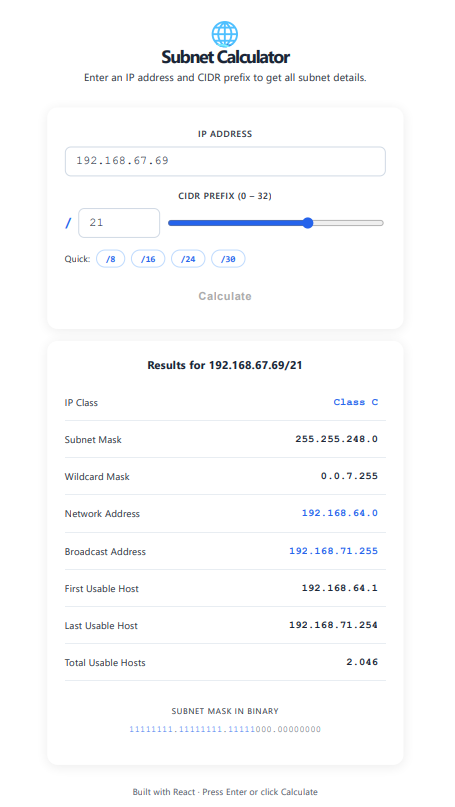

#  Subnet Calculator

A simple, clean subnet calculator web app built with React.  
Enter any IP address and CIDR prefix to instantly get all subnet details.



---

##  What It Calculates

| Output | Example |
|---|---|
| Subnet Mask | 255.255.255.0 |
| Wildcard Mask | 0.0.0.255 |
| Network Address | 192.168.1.0 |
| Broadcast Address | 192.168.1.255 |
| First Usable Host | 192.168.1.1 |
| Last Usable Host | 192.168.1.254 |
| Total Usable Hosts | 254 |
| IP Class | Class C |
| Binary Mask | 11111111.11111111.11111111.00000000 |

---

##  Why I Built This

I'm a computer networking student and subnetting is one of the core skills we practice daily — calculating network addresses, finding host ranges, and understanding CIDR notation.

I built this tool to:
- Practice turning networking theory into working code
- Learn React and how JavaScript handles binary math
- Create something actually useful for other networking students

---

## How It Works (The Math)

Subnetting is based on **bitwise operations** — the same logic that real routers use.

**1. Build the subnet mask from the CIDR prefix**
```
/24 → 24 ones followed by 8 zeros
     11111111.11111111.11111111.00000000
     = 255.255.255.0
```

**2. Find the Network Address**
```
IP AND Mask = Network Address
192.168.1.45  →  11000000.10101000.00000001.00101101
255.255.255.0 →  11111111.11111111.11111111.00000000
                 ───────────────────────────────────
                 11000000.10101000.00000001.00000000
                 = 192.168.1.0  
```

**3. Find the Broadcast Address**
```
Network OR (NOT Mask) = Broadcast Address
192.168.1.0   →  11000000.10101000.00000001.00000000
NOT mask      →  00000000.00000000.00000000.11111111
                 ───────────────────────────────────
                 11000000.10101000.00000001.11111111
                 = 192.168.1.255  
```

**4. Usable hosts**
```
Total hosts = 2^(32 - prefix) - 2
/24 → 2^8 - 2 = 254 hosts
```
*(We subtract 2 because the network address and broadcast address can't be assigned to devices.)*

---

## Built With

- [React](https://react.dev/) — UI framework
- Vanilla JavaScript — all subnet math is written from scratch, no libraries
- CSS-in-JS — inline styles, no extra dependencies

---

##  Project Structure

```
subnet-calculator/
├── src/
│   ├── App.jsx          # Main component and UI
│   └── main.jsx         # React entry point
├── public/
│   └── index.html
├── package.json
└── README.md
```

---

##  Run It Locally

**Requirements:** Node.js installed on your computer.

```bash
# 1. Clone this repository
git clone https://github.com/allamsamudra/subnet-calculator.git

# 2. Go into the project folder
cd subnet-calculator

# 3. Install dependencies
npm install

# 4. Start the app
npm run dev
```

Then open [http://localhost:5173](http://localhost:5173) in your browser.


---

##  About Me

I'm a vocational high school student majoring in Computer Networking.  
This project is part of my self-learning journey into software development.

- GitHub: [@allamsamudra](https://github.com/allamsamudra)

---

##  License

MIT License — free to use and modify.